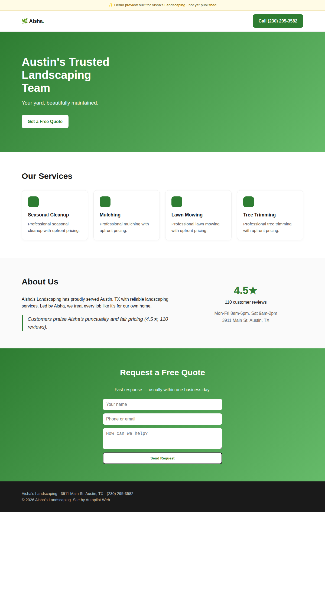
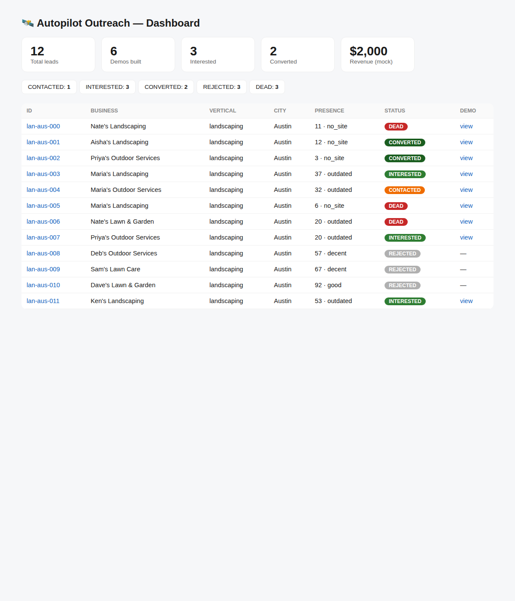

# Autopilot Outreach

An autonomous system that discovers local small businesses, evaluates their web
presence, builds or redesigns a website for them on spec, and reaches out
(including via AI voice) to sell it — "I already built you a site, want to see
it free? Keep it for $1,000."

There are two layers in this folder:

- **[`docs/DESIGN.md`](docs/DESIGN.md)** — the full architecture brainstorm:
  subsystems, tooling, scale, unit economics, and the legal/compliance realities
  (TCPA/DNC/scraping) that shape everything.
- **A working MVP** you can run *right now, offline, with zero API keys* — it
  runs the entire funnel in mock mode and generates **real, viewable demo
  websites**.

---

## Quickstart (no setup, no dependencies, no keys)

Everything runs on the Python 3.9+ standard library.

```bash
cd autopilot-outreach

python3 run.py demo          # run a full mock campaign end-to-end
python3 run.py dashboard     # then open http://localhost:8000
```

That's it. `demo` will:
1. **Discover** 12 fake landscaping businesses in Austin
2. **Score** each one's web presence (`no_site` / `outdated` / `decent` / `good`)
3. **Reject** the ones with good sites; **qualify + enrich** the rest
4. **Generate a real website** for each target → `data/demos/<id>/index.html`
5. **Run compliance gates** (DNC scrub, calling-hours) then **email + AI-call**
   each lead (artifacts written to `data/outbox/`)
6. **Collect mock payment** from interested leads and report the funnel + revenue

Then the **dashboard** shows the funnel, per-lead audit trails, the call
transcripts, and the generated sites themselves.

### Other commands

```bash
python3 run.py demo --city Phoenix --category auto_repair --limit 15
python3 run.py --seed 7 demo        # different (still deterministic) dataset
python3 run.py list                 # all leads + statuses
python3 run.py show <lead_id>       # one lead's full audit trail
python3 run.py summary              # funnel counts + revenue
python3 run.py reset                # wipe local db + generated artifacts

make test                           # run the test suite (10 tests, stdlib unittest)
```

Verticals available in mock mode: `landscaping`, `auto_repair`, `plumbing`.

---

## What it looks like

Generated demo site (real HTML, themed per vertical, grounded in the lead's
actual data — owner name, city, services, rating):



Funnel dashboard:



---

## How it's built (and how to make it real)

```
run.py                      # single CLI entrypoint
src/autopilot/
  config.py                 # env-driven settings; APOP_MODE=mock|live
  models.py                 # Lead dataclass + status state machine
  store.py                  # sqlite lead store
  compliance.py             # DNC / calling-hours / AI-disclosure gates
  pipeline.py               # the orchestrator (discover→qualify→build→reach→convert)
  providers/
    base.py                 # provider interfaces + mock/live factory
    mock.py                 # deterministic offline fakes (what runs by default)
    live.py                 # documented stubs for the real APIs
  sitegen/renderer.py       # generates the demo website HTML
  dashboard/server.py       # stdlib http dashboard
tests/test_pipeline.py      # end-to-end + unit tests
```

**The key design choice:** every external dependency (Google Places, presence
analysis, LLM copywriting, email, voice, payment) sits behind an interface in
`providers/base.py`. Mock implementations run offline; `live.py` has a
documented stub for each, mapping to the real API and failing with a clear
message until you implement it and supply a key. **Switching a stage from mock
to live never touches pipeline code** — you implement one provider method at a
time and that stage starts working.

To go live: set `APOP_MODE=live`, add keys (see `requirements.txt` and
`config.py`), and fill in the providers in `src/autopilot/providers/live.py`.
Start with discovery + presence + sitegen + email (lowest legal risk); wire the
voice provider last and with the compliance guardrails in `compliance.py`. See
`docs/DESIGN.md` §7 and §10 for the recommended build order and the legal
constraints — the voice-cold-call piece is the part to scope down, not the
centerpiece.
